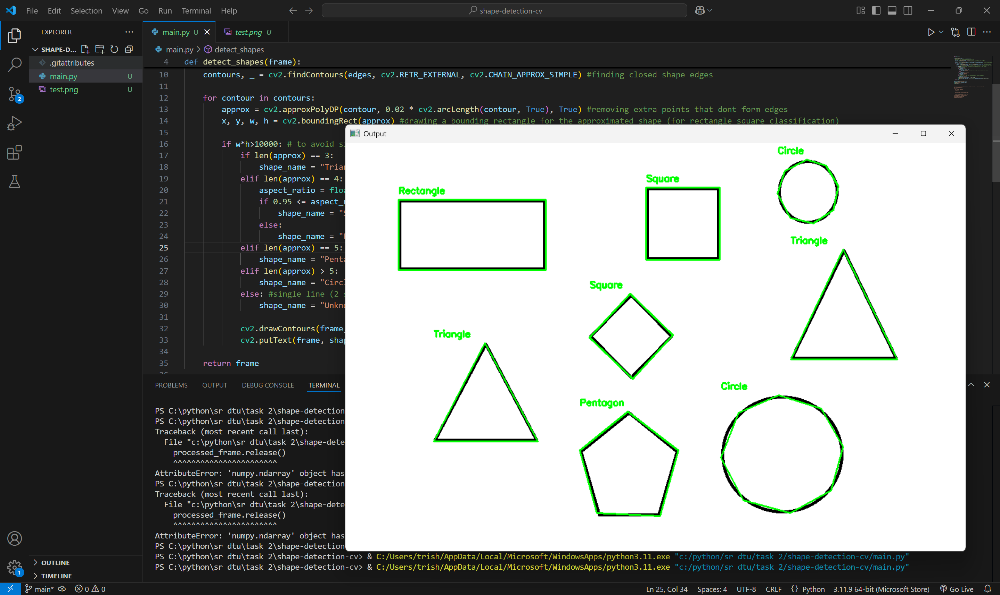

# 🔺 Shape Detection with OpenCV

A simple Python program that detects basic geometric shapes (Triangle, Square, Rectangle, Pentagon, Circle) from an image or live webcam feed using OpenCV.

## 🧠 Features

- Detects and labels shapes in images: Triangle, Square, Rectangle, Pentagon, and Circle.
- Filters out noisy or small contours to reduce false detections.
- Can process either a static image or a live video feed.
- Uses contour approximation and aspect ratio to distinguish between rectangles and squares.

## 📸 Example

### Input Image (`test.png`)
The program reads an image and detects shapes like:



### Output (Labeled Shapes)
Contours are drawn and shapes are labeled on the image.

## 🧾 Requirements

- Python 3.x
- OpenCV (`cv2`)
- NumPy

Install dependencies with:

```bash
pip install opencv-python numpy
